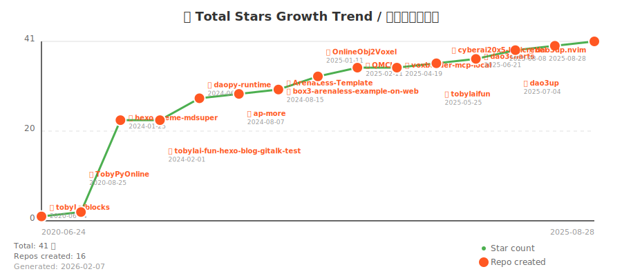

# 👋 Hi, I'm Toby Lai (@tobylaifun)
# 👋 嗨，我是 Toby Lai (@tobylaifun)

  
  
  
  

---

focusing on interesting things

I love [dao3.fun](https://dao3.fun), a platform for creating & playing maps!  
也热爱 [dao3.fun 神奇代码岛](https://dao3.fun)，一个属于创作者和玩家的地图平台。

## 📈 GitHub Statistics / GitHub 统计

| 📊 统计项 | 📈 数值 |
|:---:|:---:|
| 🏆 **Total Stars / 总星标数** | **⭐ 41** |
| 📦 **Public Repositories / 公开仓库** | **19** |
| 👥 **Followers / 关注者** | **59** |

---

## ⭐ 推荐项目 / Recommended Projects

| Repository | Description | Stars | Language | Updated |
| ---------- | ----------- | ----- | -------- | ------- |
| [hexo-theme-mdsuper](https://github.com/tobylaifun/hexo-theme-mdsuper) | A hexo blog theme using mdui-v2 with Material You (Material Design 3). Supports ... | ⭐ 21 | CSS | 2026-02-05 |
| [daopy-runtime](https://github.com/tobylaifun/daopy-runtime) | 在岛三上运行Python，并支持访问API | ⭐ 5 | Python | 2026-01-14 |
| [OnlineObj2Voxel](https://github.com/tobylaifun/OnlineObj2Voxel) | Online Obj2Voxel using WebAssembly+Eisenwave/obj2voxel and preact | ⭐ 3 | JavaScript | 2025-01-13 |
| [QMCLI](https://github.com/tobylaifun/QMCLI) | A Quick Minecraft Launcher CLI (Work In Progress) 一个快速的Minecraft启动器CLI（开发中） | ⭐ 2 | TypeScript | 2025-02-22 |
| [dao3up](https://github.com/tobylaifun/dao3up) | 适用于ArenaPro的构建/上传工具CLI，可以支持bun/esbuild/deno(emit) | ⭐ 2 | TypeScript | 2025-11-29 |
| [tobyLaiblocks](https://github.com/tobylaifun/tobyLaiblocks) | 一个使用blockly做的可运行、生成代码的编辑器 | ⭐ 1 | JavaScript | 2022-07-30 |
| [ap-more](https://github.com/tobylaifun/ap-more) | No description | ⭐ 1 | Python | 2024-08-12 |
| [dao3up.nvim](https://github.com/tobylaifun/dao3up.nvim) | 适用于 dao3up 的 Neovim 插件  可以实现一些原本在 Vscode + ArenaPro Creator 上的编辑功能 | ⭐ 1 | Lua | 2025-08-29 |
| [TobyPyOnline](https://github.com/tobylaifun/TobyPyOnline) | TobyPyOnline，在前端运行python！ | ⭐ 1 | JavaScript | 2020-08-29 |
| [dao3charts](https://github.com/tobylaifun/dao3charts) | Draw charts like bar,line,pie on Arena(dao3.fun) | ⭐ 1 | TypeScript | 2025-07-08 |

---

## ❤️ What I Like / 偏好

热爱 TypeScript、Node.js 和 Python 等技术栈，积极探索 Deno、Bun 等新兴运行时。前端方面偏好 React 和 Vue 框架，业余时间也喜欢研究 Minecraft 开发、游戏平台搭建等有趣的项目。

---

## 📫 Links & Contact / 联系

- 📝 [Blog tobylai.fun](https://tobylai.fun)
- 🤝 [@Box3TRC Organization](https://github.com/Box3TRC)  
- 💬 [dao3.fun](https://dao3.fun)  

---

## 📊 GitHub Stats & Analytics / GitHub 数据分析

### 📈 GitHub Contribution Graph / GitHub 贡献图

### ⭐ Total Stars Growth Trend / 总星标增长趋势

**Summary / 摘要:**
- 📅 From 2020-06-24 to 2025-08-28 (1892 days)
- 📈 Growth: 1 → 41 stars (+40)
- 💫 Average: ~0.02 stars/day
- 🎯 Repositories created during this period: 16

*Chart shows cumulative stars over time. 🔴 Red dots mark repository creation dates.*

### 📊 GitHub Profile Views / 访问统计

---

_Thanks for visiting! Feel free to explore my projects and reach out for collaboration or discussion._  
_感谢访问！欢迎探索我的项目，也期待与你交流合作。_

---

Last updated: 2026-02-07 06:31:51 UTC | Auto-generated by [generate_readme.py](generate_readme.py)
